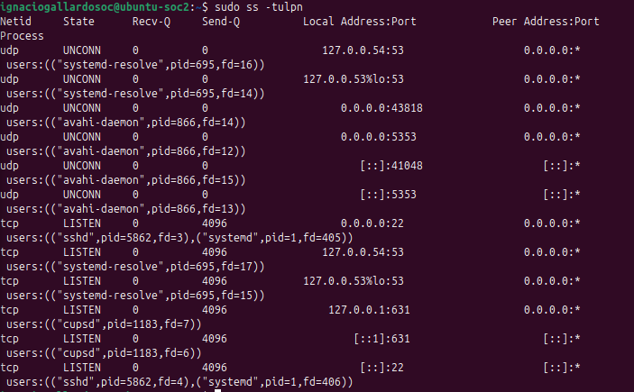
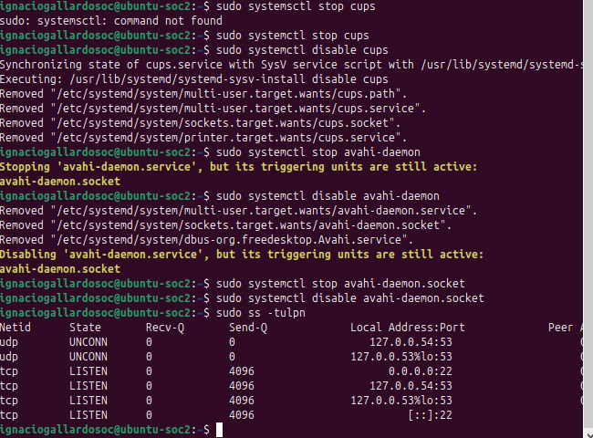
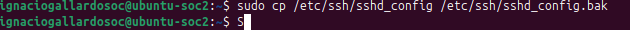
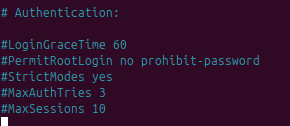
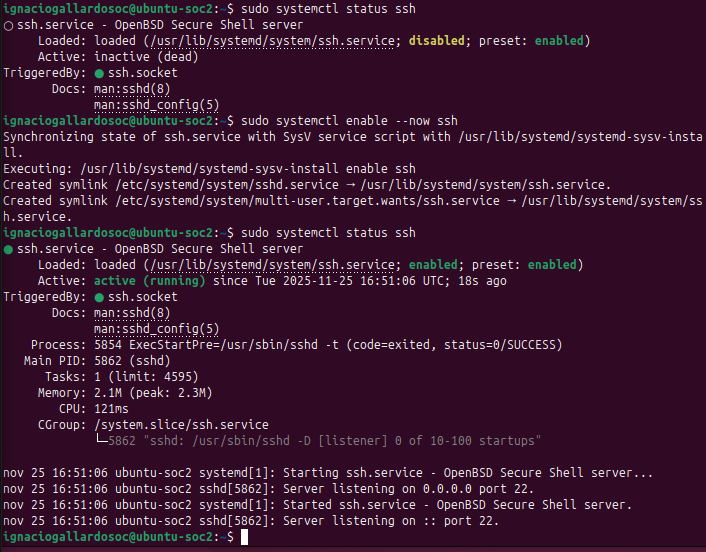
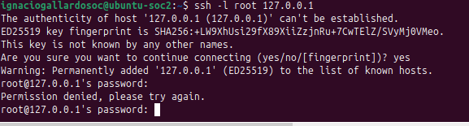
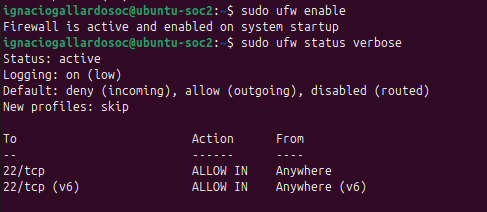

# 🛡️ Proyecto: Linux Server Hardening (SSH & Firewall)

## 📌 Resumen Ejecutivo
Despliegue y aseguramiento de un servidor Linux Ubuntu mediante metodologías de **Hardening** (Endurecimiento). El objetivo principal fue reducir la superficie de ataque eliminando servicios innecesarios, blindando el acceso remoto contra ataques de fuerza bruta y estableciendo un perímetro de red seguro.

## 🛠️ Entorno Tecnológico
- **OS:** Ubuntu Server 22.04 LTS (Virtual Machine)
- **Servicios:** OpenSSH, Systemd
- **Seguridad:** UFW (Uncomplicated Firewall)
- **Herramientas:** `ss` (Socket Statistics), `nano`, `systemctl`

---

## 🚀 Fase 1: Auditoría y Reducción de Superficie

### 1.1. Análisis de Estado Inicial
Se realizó una auditoría de puertos con `ss -tulpn` detectando servicios innecesarios expuestos por defecto (CUPS/Impresión y Avahi/mDNS), lo cual representaba un riesgo de seguridad al exponer puertos sin uso legítimo.

### 1.2. Eliminación de Servicios
Aplicando el principio de "Menor Privilegio", se detuvieron y deshabilitaron los servicios vulnerables para asegurar que no inicien con el sistema, reduciendo el consumo de recursos y cerrando vectores de ataque.
- **Comandos:** `systemctl stop` y `systemctl disable`.

---

## 🔒 Fase 2: Hardening de Acceso Remoto (SSH)

### 2.1. Backup y Configuración
Antes de cualquier modificación, se realizó un respaldo del archivo de configuración crítica (`sshd_config`). Posteriormente, se editaron las directivas de seguridad para prohibir el acceso directo del usuario `root` y limitar los intentos de conexión.

### 2.2. Validación del Servicio
Se verificó la sintaxis de la configuración para evitar errores y se reinició el servicio SSH, confirmando su estado activo y funcional con la nueva política de seguridad cargada.

### 2.3. Prueba de Concepto (PoC)
Para validar la efectividad del Hardening, se simuló un intento de acceso no autorizado utilizando el usuario `root`. El sistema rechazó la conexión inmediatamente (`Permission denied`), validando el bloqueo exitoso.

---

## 🔥 Fase 3: Seguridad Perimetral (Firewall)

### 3.1. Implementación de UFW
Se configuró el Firewall del sistema bajo una política de **Denegación Implícita** (Default Deny Incoming), permitiendo únicamente el tráfico entrante por el puerto 22 (SSH) para administración remota. Todo otro tráfico no solicitado es bloqueado.

---

## ✅ Conclusión
El servidor ha pasado de un estado "Inseguro por defecto" a una configuración **Hardened**. Se han mitigado vectores de ataque comunes y se ha establecido un control estricto sobre quién puede acceder al sistema y qué servicios están disponibles en la red.
